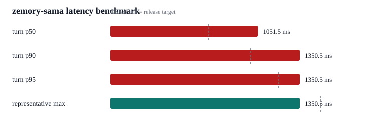
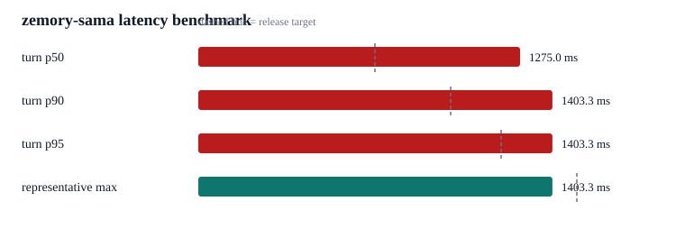
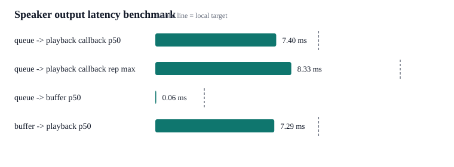
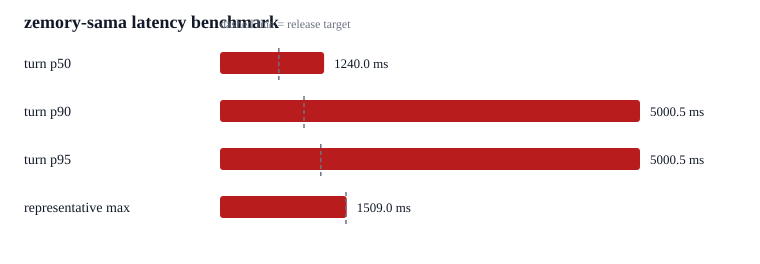
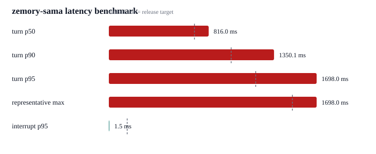
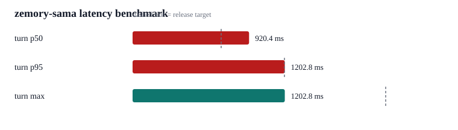
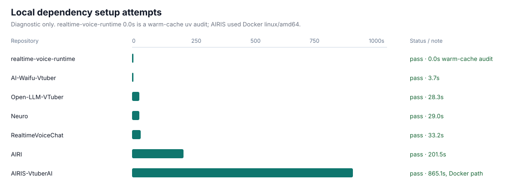

# zemory-sama

Low-latency realtime voice conversation runtime for multilingual AI agents.

`zemory-sama` is a Python CLI voice agent core. It focuses on the hard part of a
voice-first assistant before UI, avatar rendering, or streaming integrations:
capturing microphone audio, detecting turns, producing the first audible
response quickly, handling interruptions, and keeping the conversation state
coherent over long sessions.

The default runtime uses OpenAI Realtime GA audio-in/audio-out with
`gpt-realtime-2`, low-latency `server_vad` at a 200 ms silence window, and
direct PCM playback. `semantic_vad`, external TTS, and local VAD/STT remain
available as explicit choices rather than the default fast path.

## One-Prompt Setup For Coding Agents

Paste this into Claude Code, Codex, or another repository-aware coding agent:

```text
Set up and validate this repository for local manual testing.

Rules:
- Read the repo instructions and inspect the current tree before changing files.
- Do not read, print, commit, or infer secrets from .env.
- Use built-in agent tools when available: plan for multi-step work, ask_user/request_user_input only when a missing secret or hardware decision blocks progress, and use repository search instead of guessing.
- Keep changes surgical. If setup requires edits, explain why and verify them.

Steps:
1. Inspect README.md, pyproject.toml, config.toml, zemory/config.py, zemory/orchestrator.py, and tests/.
2. Run uv sync.
3. If .env is missing, create it from .env.example without inventing API keys. Tell the user to set OPENAI_API_KEY; ELEVENLABS_API_KEY is only needed for external TTS profiles.
4. Run uv run pytest tests/, uv run ruff check zemory tests scripts, and uv run python -m compileall zemory tests scripts.
5. If checks pass and OPENAI_API_KEY is present, start a manual voice session with uv run python -m zemory. For a detachable session, use tmux new-session -s zemory-sama-test 'uv run python -m zemory'.
6. Report the active profile, whether Realtime reached session.configured, where logs are stored, and the stop command.
```

## What It Does

- Streams microphone PCM to OpenAI Realtime and plays audio deltas directly.
- Uses a 200 ms `server_vad` default for the fastest measured stable turn
  endings; `semantic_vad` is still configurable for more conservative turns.
- Mirrors the user's language by default, so Korean and English conversation
  both stay natural without switching profiles.
- Supports barge-in: clear speaker output, cancel pending TTS work, cancel the
  active Realtime response, and preserve interrupted assistant partials.
- Keeps provider boundaries small: turn detection, STT, LLM, and TTS can be
  swapped by profile.
- Includes async memory/tool scheduling so context retrieval does not block
  first audio.
- Records latency metrics and ships a JSONL benchmark checker.
- Runs hardware-free regression tests for the core orchestration contracts.

## Performance Snapshot

Benchmarks were refreshed on 2026-06-27 and 2026-06-28 on macOS Apple Silicon
with the `realtime_audio` profile. Artifacts are numeric-only; raw runtime logs
are not committed because they can contain private transcript text.

Final HTML comparison report: [docs/reports/2026-06-28-final-comparison](docs/reports/2026-06-28-final-comparison).

| Run | Fixture | Key result | Artifact |
| --- | --- | --- | --- |
| Optimized live fixture | 4 Korean/English macOS `say` clips, server VAD 200 ms | source-audio end to first response audio p50 1051.5 ms, representative max 1350.5 ms, no outliers | [docs/benchmarks/2026-06-27-optimized-server-vad-200](docs/benchmarks/2026-06-27-optimized-server-vad-200) |
| Live device playback | 8 Korean/English macOS `say` clips, server VAD 200 ms, speaker callback enabled | source-audio end to first local speaker playback p50 1275.0 ms, representative max 1403.3 ms; API to playback p50 6.5 ms | [docs/benchmarks/2026-06-28-live-device-playback-n8](docs/benchmarks/2026-06-28-live-device-playback-n8) |
| VAD stability sweep | 8 Korean/English macOS `say` clips, server VAD 200 ms | p50 1240.0 ms, representative max 1509.0 ms, 1 extreme outlier retained as diagnostic | [docs/benchmarks/2026-06-27-server-vad-200-n8](docs/benchmarks/2026-06-27-server-vad-200-n8) |
| Manual live session | 28 real conversation turns | turn p50 816.0 ms, representative max 1698.0 ms, 1 extreme outlier kept as diagnostic | [docs/benchmarks/2026-06-27-local-manual](docs/benchmarks/2026-06-27-local-manual) |
| Controlled audio samples | 6 Korean/English macOS `say` clips | input commit to first audio p50 920.4 ms, representative max 1202.8 ms | [docs/benchmarks/2026-06-27-controlled-say](docs/benchmarks/2026-06-27-controlled-say) |
| Speaker output callback | 24 local `SpeakerStream` output samples, 10 ms output block | queue to first playback callback p50 7.404 ms, representative max 8.326 ms, no outliers | [docs/benchmarks/2026-06-28-speaker-output-callback](docs/benchmarks/2026-06-28-speaker-output-callback) |
| Reference setup comparison | 6 major AI VTuber / realtime voice repos | all dependency setups completed with project-specific environments; no invented cross-repo latency numbers | [docs/benchmarks/2026-06-27-comparison](docs/benchmarks/2026-06-27-comparison) |















## Status

This is an active research/runtime repo, not a packaged end-user app yet.

Implemented:

- Realtime GA audio-native default profile.
- Realtime text + external TTS profile.
- Local cascade profile with Silero VAD and Whisper STT.
- Interrupt bus and partial assistant transcript preservation.
- SQLite-backed local memory store and deadline-bound context scheduler.
- Latency report utility and benchmark CLI.
- Regression suite with coverage gate.

Not implemented yet:

- Web UI, browser WebRTC, Live2D/VRM, OBS integration.
- Twitch/YouTube/Discord chat adapters.
- Hosted deployment, installable package, or CI workflow.
- Production-grade long-session compaction and vector memory.

## Runtime Profiles

| Profile | Default | Pipeline | Use case |
| --- | --- | --- | --- |
| `realtime_audio` | Yes | OpenAI Realtime GA audio input/output, `server_vad` 200 ms, `NullTTS` | Lowest-latency voice conversation |
| `realtime_text_external_tts` | No | Realtime text output, sentence chunking, external TTS | Character voice quality over minimum latency |
| `local_cascade` | No | Silero VAD, Whisper STT, Realtime text LLM, external TTS | Local turn detection fallback and development |
| `research_full_duplex` | No | Placeholder | Future full-duplex research track |

Legacy aliases `realtime` and `local` are still accepted and normalized.

## Architecture

```text
MicrophoneStream
  -> TurnDetector
     -> OpenAI Realtime session or local cascade
        -> TranscriptLedger
        -> AsyncContextScheduler
        -> InterruptBus
        -> ResponseStream
           -> audio-native: response.output_audio.delta -> SpeakerStream
           -> external TTS: text delta -> SentenceChunker -> TTSTaskManager
```

Important modules:

- `zemory/orchestrator.py` wires the runtime tasks.
- `zemory/config.py` builds profile-specific Realtime session config.
- `zemory/providers/llm/openai_realtime.py` adapts GA Realtime events.
- `zemory/pipeline/interrupt_bus.py` owns the abort chain.
- `zemory/pipeline/context.py` owns transcript, memory, and async context.
- `zemory/observability/latency_report.py` parses latency JSONL.

## Requirements

- Python 3.12+
- macOS, Linux, or another environment supported by `sounddevice`
- Working microphone and speaker device
- OpenAI API key
- ElevenLabs API key only for external TTS profiles

The default `realtime_audio` profile does not require ElevenLabs.

## Quick Start

Install dependencies:

```bash
uv sync
```

Create local secrets:

```bash
cp .env.example .env
```

Set at least:

```bash
OPENAI_API_KEY=sk-your-key-here
```

Run the voice agent:

```bash
uv run python -m zemory
```

For long-running manual testing:

```bash
tmux new-session -s zemory-sama-test 'uv run python -m zemory'
```

Stop with `Ctrl+C` or:

```bash
tmux kill-session -t zemory-sama-test
```

## Configuration

The config load order is:

1. Environment variables using the `ZEMORY_` prefix, plus legacy
   `OPENAI_API_KEY` and `ELEVENLABS_API_KEY`.
2. `config.toml`.
3. Defaults in `zemory/config.py`.

Common values:

```bash
ZEMORY_PROFILE=realtime_audio
ZEMORY_ENABLE_BARGE_IN=0
ZEMORY_RESPONSE_LENGTH="1-2 sentences"
ZEMORY_MEMORY_ENABLED=1
ZEMORY_MEMORY_PATH=.zemory/memory.sqlite3
ZEMORY_MEMORY_RECALL_DEADLINE_MS=80
ZEMORY_CONTEXT_TOOL_DEADLINE_MS=200
```

Barge-in is off by default because laptop speakers can leak into the mic and
cause false interrupts without hardware echo cancellation. Enable it when using
headphones or an AEC-capable device.

## Testing

Run the full suite:

```bash
uv run pytest tests/
```

Run lint:

```bash
uv run ruff check zemory tests scripts
```

Compile-check all Python files:

```bash
uv run python -m compileall zemory tests scripts
```

Current local verification target:

- 80 tests passing.
- 80% coverage gate.
- Core coverage currently above 86%.

## Latency Benchmarks

Runtime logs emit `turn.complete` events with timing fields such as
`total_ms`, `first_tts_byte_ms`, `speaker_buffer_ms`, and `interrupted`.
In the CLI runtime, `total_ms` is measured to the first output callback that
actually consumes response audio, not just the moment audio enters the local
speaker buffer.
The microphone and speaker streams request the device's low-latency mode in
addition to the 10 ms output callback block.

Generate README-ready artifacts from a local runtime log:

```bash
uv run python scripts/build_benchmark_artifacts.py \
  --log .zemory/run.log \
  --out docs/benchmarks/local-run \
  --title "zemory-sama realtime_audio local benchmark"
```

Run a live generated-audio benchmark against OpenAI Realtime:

```bash
uv run python scripts/bench_realtime_audio_fixture.py \
  --out docs/benchmarks/local-live-fixture \
  --turn-detection server_vad \
  --server-vad-silence-ms 200
```

Check a JSONL export against release thresholds:

```bash
uv run python scripts/bench_latency.py path/to/latency.jsonl
```

Default thresholds:

- turn p50 <= 700 ms
- turn p95 <= 1200 ms
- interrupt p95 <= 150 ms

The controlled 2026-06-27 fixture reports input-stream end/commit to first
response audio because synthetic TTS clips do not always trigger
`semantic_vad` `speech_stopped` consistently.

## Repository Layout

```text
zemory/
  audio.py                  # microphone and speaker streams
  config.py                 # settings and Realtime session shape
  orchestrator.py           # runtime task wiring
  pipeline/                 # chunking, interrupts, memory, context, TTS manager
  providers/                # LLM, STT, TTS, turn detector providers
  observability/            # metrics, logging, latency reports
tests/                      # executable behavior contracts
scripts/                    # operational scripts
docs/
  plans/                    # architecture and migration plans
  ref/                      # reference project analysis
```

## Design Notes

The current design intentionally chooses a simple Realtime-first path:

- audio-native output before external TTS by default
- server-side semantic turn detection before local heuristics
- deadline-bound context retrieval before blocking RAG
- explicit profiles before runtime magic
- no legacy preview Realtime path

See [docs/plans/optimal-low-latency-design.md](docs/plans/optimal-low-latency-design.md)
for the detailed design.

## Security And Privacy

- Do not commit `.env`.
- `.zemory/` is ignored and can contain local memory or runtime logs.
- Microphone audio is sent to OpenAI in Realtime profiles.
- External TTS profiles send assistant text to the configured TTS provider.
- Review runtime logs before sharing them; they may contain conversation text.

## License

No license has been specified yet.
