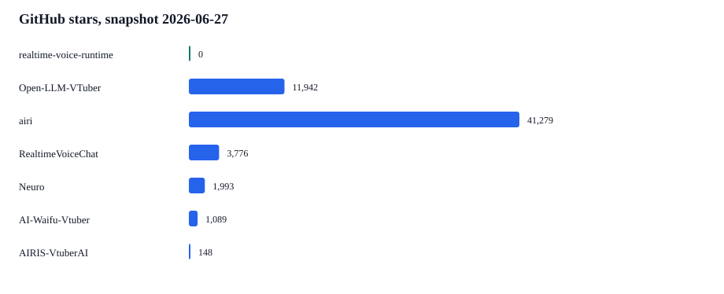
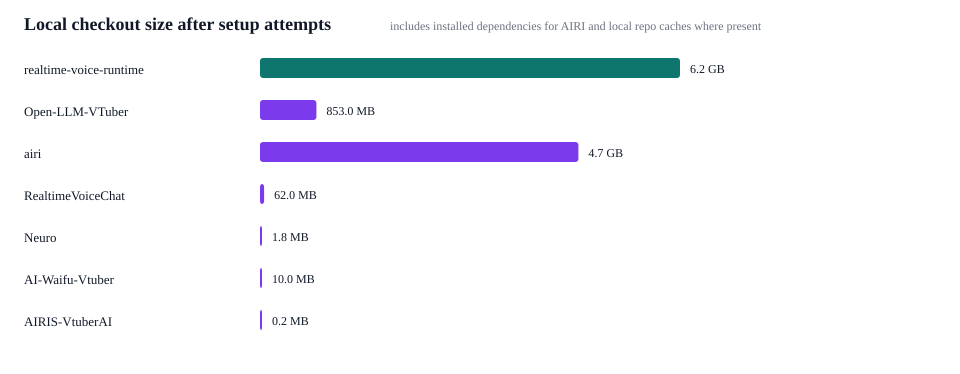

# Competitive Benchmark Snapshot — 2026-06-27

Evidence type: local benchmark artifacts, updated local clones under `_ref/`, GitHub metadata from `gh repo view`, and dependency setup attempts on this machine.

Environment: macOS 26.3.1 on Apple Silicon, Python 3.12.12, Node v25.6.0, uv 0.8.3, pnpm 10.33.0, Docker 29.1.3. `portaudio` was installed via Homebrew for PyAudio-based projects. AIRIS required Docker `linux/amd64` plus build tools to complete dependency setup.

## Repository Freshness

| Repository | Stars | Forks | Last pushed | Local commit | Latest release |
| --- | ---: | ---: | --- | --- | --- |
| [MeroZemory/zemory-sama](https://github.com/MeroZemory/zemory-sama) | 0 | 0 | 2026-06-27 | `9281f06` | - |
| [Open-LLM-VTuber/Open-LLM-VTuber](https://github.com/Open-LLM-VTuber/Open-LLM-VTuber) | 11,942 | 1,398 | 2026-05-15 | `992309c` | v1.2.1 |
| [moeru-ai/airi](https://github.com/moeru-ai/airi) | 41,279 | 4,152 | 2026-06-27 | `1065ed5` | v0.10.2 |
| [KoljaB/RealtimeVoiceChat](https://github.com/KoljaB/RealtimeVoiceChat) | 3,776 | 443 | 2025-07-11 | `9de323f` | - |
| [kimjammer/Neuro](https://github.com/kimjammer/Neuro) | 1,993 | 224 | 2025-01-17 | `5e4b424` | v0.2.2 |
| [ardha27/AI-Waifu-Vtuber](https://github.com/ardha27/AI-Waifu-Vtuber) | 1,089 | 176 | 2026-05-31 | `fb46603` | - |
| [StudioMovieGirl/AIRIS-VtuberAI](https://github.com/StudioMovieGirl/AIRIS-VtuberAI) | 148 | 13 | 2026-01-03 | `cbc833c` | - |

## Setup Attempt Results

These are dependency setup attempts, not voice latency and not a product-quality score. They show how much work was needed before a fair runtime benchmark could even start. Several projects need external API keys, model downloads, OBS/Twitch/Live2D services, or GPU/local model assets before end-to-end latency can be measured.

The zemory-sama 0.0s row is a warm-cache `uv sync --frozen` audit on this machine. It is kept for traceability, but it should not be used as a setup-time superiority claim.

| Repository | Final setup status | Duration | Environment / command type | Evidence tail |
| --- | --- | ---: | --- | --- |
| MeroZemory/zemory-sama | pass | 0.0s | warm-cache `uv sync --frozen` audit | Audited 51 packages in 0.04ms |
| ardha27/AI-Waifu-Vtuber | pass | 3.7s | `uv pip install -r requirements after brew portaudio` | warning: The package `httpx==0.13.3` does not have an extra named `http2` |
| Open-LLM-VTuber/Open-LLM-VTuber | pass | 28.3s | `uv sync` |  + yarl==1.22.0 |
| kimjammer/Neuro | pass | 29.0s | `macos arm64 Python 3.11` | warning: The package `realtimetts==0.4.1` does not have an extra named `coqui` |
| KoljaB/RealtimeVoiceChat | pass | 33.2s | `uv pip install -r requirements after brew portaudio` |  + yarl==1.24.2 |
| moeru-ai/airi | pass | 201.5s | `pnpm install` | Done in 3m 17.7s using pnpm v10.33.0 |
| StudioMovieGirl/AIRIS-VtuberAI | pass | 865.1s | `docker linux/amd64 python:3.10-slim + build-essential + portaudio19-dev` |  + yarl==1.24.2 |

## Runtime Latency Evidence

Only zemory-sama produced numeric latency artifacts under a repeatable local harness in this run:

- Manual live session: [../2026-06-27-local-manual](../2026-06-27-local-manual)
- Controlled macOS `say` TTS samples: [../2026-06-27-controlled-say](../2026-06-27-controlled-say)

A direct latency bake-off against the reference repos would be misleading here: the updated reference repos do not expose a common non-interactive fixture equivalent to `speech_end/input commit -> first audio`, and their runtime defaults differ materially (full VTuber app, browser app, local cascade, Twitch/OBS integration, or GPU/local model stack). The fair result is therefore: zemory-sama has measured latency artifacts for its own ablation decisions; the others were setup-tested and compared by architecture/readiness, but not assigned invented latency numbers.

## Architectural Comparison

| Project | Default emphasis | Voice path | Barge-in / interrupt | Benchmark readiness in this run |
| --- | --- | --- | --- | --- |
| zemory-sama | CLI realtime voice core | OpenAI Realtime GA audio-native default | Implemented and measured | Numeric latency artifacts generated |
| Open-LLM-VTuber | Full VTuber app with Live2D and provider breadth | Cascaded VAD/STT/LLM/TTS style options | README advertises voice interruption | Dependencies installed, no common latency fixture found |
| AIRI | Large multi-app character platform | Browser/desktop/mobile voice stacks | Broad platform work, not a small CLI latency harness | Dependencies installed, monorepo setup cost high |
| RealtimeVoiceChat | Community realtime voice chat server | RealtimeSTT + RealtimeTTS cascade | README advertises graceful interruptions | Dependencies installed after PortAudio; runtime still requires provider/model configuration |
| Neuro | VTuber memory/RAG/Twitch-oriented agent | RealtimeSTT/RealtimeTTS cascade | Not the primary latency-core reference | Dependencies installed with Python 3.10/3.11 after PortAudio |
| AI-Waifu-Vtuber | Streaming/chat VTuber reference | Legacy OpenAI/TTS streaming path | Not a modern Realtime GA path | Dependencies installed after PortAudio; legacy OpenAI 0.28 path |
| AIRIS-VtuberAI | Local/GPU VTuber pipeline | Faster Whisper/local model stack | Planned/experimental in docs | Dependencies installed only in Docker linux/amd64 with build tools; native macOS ARM blocked by bitsandbytes |

## Popularity Context

zemory-sama is new and has no meaningful public star history yet. This chart is for context, not runtime quality.

## Local Footprint Context

