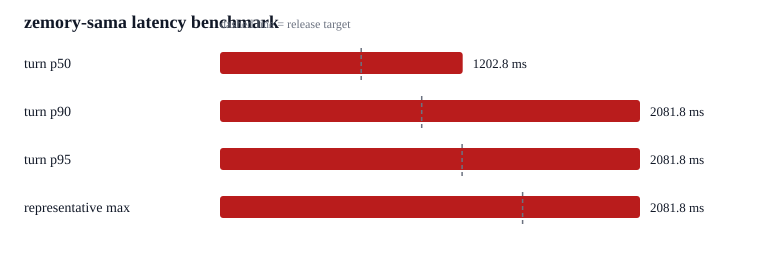

# zemory-sama server_vad 195ms n8 benchmark

8 macOS say fixtures streamed as realtime 24 kHz PCM. Mode=semantic_vad; turn_detection=server_vad; semantic_vad eagerness=high; server_vad threshold=0.5; server_vad silence=195 ms. Metric is final source-audio chunk sent to first response audio delta; raw transcripts are not recorded.

| Metric | Value |
| --- | ---: |
| turn count | 8 |
| total events | 8 |
| invalid latency samples | 0 |
| early cutoffs | 0 |
| turn min | 1011.4 ms |
| turn mean | 1331.4 ms |
| turn p50 | 1202.8 ms |
| turn p90 | 2081.8 ms |
| turn p95 | 2081.8 ms |
| representative max | 2081.8 ms |
| extreme outliers | 0 |
| observed max, diagnostic | 2081.8 ms |
| interrupt count | 0 |
| interrupt p95 | n/a |

