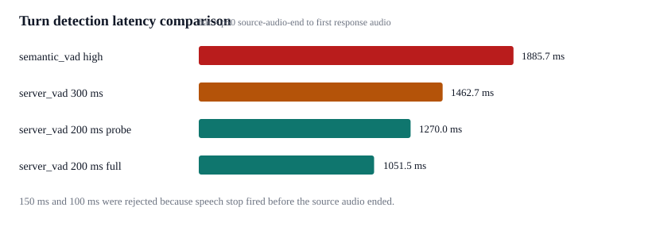
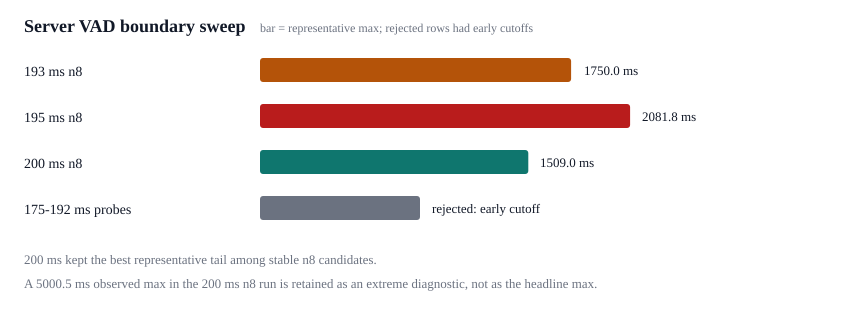

# Turn Detection Optimization - 2026-06-27

Goal: reduce source-audio-end to first response audio without treating random extreme max values as representative latency.

## Evidence Used

- [OpenAI Realtime VAD documentation](https://developers.openai.com/api/docs/guides/realtime-vad): Realtime sessions support `server_vad` and `semantic_vad`; turn detection is configurable through `session.audio.input.turn_detection`.
- [OpenAI latency optimization guidance](https://developers.openai.com/api/docs/guides/latency-optimization): stream outputs, keep responses short, and measure first-token/first-audio latency separately from full completion latency.
- [FastTurn](https://arxiv.org/html/2604.01897v1): recent turn-detection research frames the target as low latency while preserving robust end-of-turn decisions by combining acoustic and streaming semantic cues.
- [FD-Bench](https://arxiv.org/html/2503.04721v3): recent full-duplex dialogue benchmarking measures response latency from the end of user speech to the start of model response and avoids mixing in unrelated silence periods.
- Reference repo review:
  - RealtimeVoiceChat uses dynamic pause and quick first-audio strategies.
  - Neuro uses a short `post_speech_silence_duration` of 0.4 seconds.
  - AIRI documents first streaming audio packet latency as the relevant UX metric for streaming TTS.

## Local Experiments

All rows use macOS `say` fixtures streamed as realtime 24 kHz PCM. Metric is final source-audio chunk sent to first response audio delta. Raw transcripts are not recorded.

| Candidate | Samples | p50 | Representative max | Result |
| --- | ---: | ---: | ---: | --- |
| `semantic_vad`, eagerness `high` | 2 | 1885.7 ms | 2660.2 ms | Stable but slower VAD wait |
| `semantic_vad`, eagerness `medium` | 1 attempted | n/a | n/a | Timed out on the first fixture |
| `server_vad`, silence 300 ms | 2 | 1462.7 ms | 2318.1 ms | Faster than semantic VAD |
| `server_vad`, silence 200 ms | 2 | 1270.0 ms | 1284.0 ms | Fastest stable two-sample probe |
| `server_vad`, silence 150 ms | 2 | n/a | n/a | Rejected: speech stop fired before source audio ended |
| `server_vad`, silence 100 ms | 2 | n/a | n/a | Rejected: speech stop fired before source audio ended |
| `server_vad`, silence 200 ms | 4 | 1051.5 ms | 1350.5 ms | Chosen default |

## Boundary Sweep

After selecting 200 ms, a second pass tested whether the stable window could be pushed lower. These runs use the same generated audio harness. `turn_count` is the number of valid latency samples; early cutoffs are invalid samples where server VAD fired before the source audio finished.

| Candidate | Events | Valid turns | Early cutoffs | p50 | Representative max | Result |
| --- | ---: | ---: | ---: | ---: | ---: | --- |
| `server_vad` 175 ms, threshold 0.5 | 2 | 1 | 1 | 1290.0 ms | 1290.0 ms | Rejected |
| `server_vad` 180 ms, threshold 0.5 | 2 | 1 | 1 | 1012.7 ms | 1012.7 ms | Rejected |
| `server_vad` 180 ms, threshold 0.6 | 2 | 0 | 2 | n/a | n/a | Rejected |
| `server_vad` 180 ms, threshold 0.7 | 2 | 0 | 2 | n/a | n/a | Rejected |
| `server_vad` 180 ms, threshold 0.8 | 2 | 0 | 2 | n/a | n/a | Rejected |
| `server_vad` 190 ms, threshold 0.5 | 2 | 1 | 1 | 1185.2 ms | 1185.2 ms | Rejected |
| `server_vad` 192 ms, threshold 0.5 | 2 | 1 | 1 | 1073.7 ms | 1073.7 ms | Rejected |
| `server_vad` 193 ms, threshold 0.5 | 8 | 8 | 0 | 1318.5 ms | 1750.0 ms | Stable but slower tail than 200 ms |
| `server_vad` 195 ms, threshold 0.5 | 8 | 8 | 0 | 1202.8 ms | 2081.8 ms | Stable but worse tail than 200 ms |
| `server_vad` 200 ms, threshold 0.5 | 8 | 8 | 0 | 1240.0 ms | 1509.0 ms | Kept as default |

## Decision

`realtime_audio` defaults to `server_vad` with `silence_duration_ms=200`.
The 193 ms and 195 ms candidates were stable in the larger sweep, but neither improved the representative tail over 200 ms. Windows below 193 ms cut off generated Korean and/or English fixtures before the source audio had finished.
`semantic_vad` remains configurable for conversations where avoiding early turn endings is more important than minimum latency.

The speaker output callback block size was lowered from 40 ms to 20 ms in the first pass, then to 10 ms on 2026-06-28. Runtime `turn.complete` now records `total_ms` against the first output callback that consumes response audio, and also emits `speaker_buffer_ms` so local buffer-to-callback delay is visible. This is a playback-path improvement and is not reflected in the API first-audio benchmark above.
