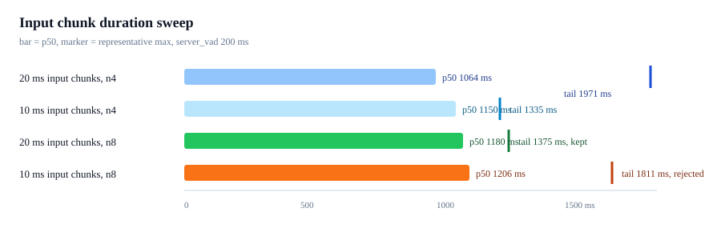

# Input Chunk Duration Sweep - 2026-06-28

Goal: test whether lowering Realtime input audio chunks from 20 ms to 10 ms
improves source-audio-end to first response audio latency.

## Result

Keep the default input chunk duration at 20 ms.

The 10 ms input chunk did not improve the larger n8 comparison. It was slightly
slower at p50 and substantially worse at representative max. Both candidates
were stable with no early cutoffs, so this decision is based on measured latency
rather than correctness failure.

| Candidate | Events | Valid turns | Early cutoffs | p50 | Representative max | Result |
| --- | ---: | ---: | ---: | ---: | ---: | --- |
| 20 ms input chunks, n4 | 4 | 4 | 0 | 1064.2 ms | 1971.0 ms | Probe only |
| 10 ms input chunks, n4 | 4 | 4 | 0 | 1150.4 ms | 1334.5 ms | Probe only |
| 20 ms input chunks, n8 | 8 | 8 | 0 | 1179.6 ms | 1374.9 ms | Kept |
| 10 ms input chunks, n8 | 8 | 8 | 0 | 1205.6 ms | 1810.5 ms | Rejected |

## Artifacts

- [20 ms n4](../2026-06-28-input-chunk-20-n4)
- [10 ms n4](../2026-06-28-input-chunk-10-n4)
- [20 ms n8](../2026-06-28-input-chunk-20-n8)
- [10 ms n8](../2026-06-28-input-chunk-10-n8)

All rows use macOS `say` fixtures streamed as realtime 24 kHz PCM with
`server_vad` threshold 0.5 and silence 200 ms. Raw transcripts are not recorded.
