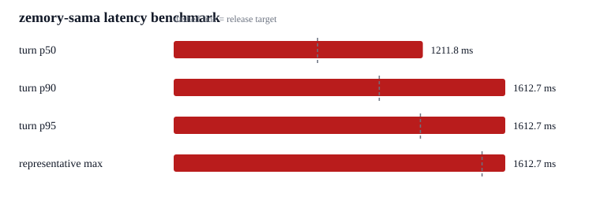

# zemory-sama old response length device playback benchmark n8

8 macOS say fixtures streamed as realtime 24 kHz PCM. Mode=semantic_vad; turn_detection=server_vad; semantic_vad eagerness=high; server_vad threshold=0.5; server_vad silence=200 ms. Input chunk=20 ms. response length=1-2 sentences. play_output=True. Metric is final source-audio chunk sent to first local speaker playback callback; api_first_audio_ms retains the API first-audio delta timestamp. raw transcripts are not recorded.

| Metric | Value |
| --- | ---: |
| turn count | 8 |
| total events | 8 |
| invalid latency samples | 0 |
| early cutoffs | 0 |
| turn min | 1004.6 ms |
| turn mean | 1204.6 ms |
| turn p50 | 1211.8 ms |
| turn p90 | 1612.7 ms |
| turn p95 | 1612.7 ms |
| representative max | 1612.7 ms |
| extreme outliers | 0 |
| observed max, diagnostic | 1612.7 ms |
| api first audio p50 | 1204.0 ms |
| api first audio representative max | 1611.8 ms |
| api to playback p50 | 5.1 ms |
| api to playback representative max | 9.8 ms |
| speaker buffer p50 | 5.0 ms |
| speaker buffer representative max | 9.7 ms |
| vad wait p50 | 500.5 ms |
| vad wait representative max | 539.5 ms |
| first audio after speech stopped p50 | 606.5 ms |
| first audio after speech stopped representative max | 742.5 ms |
| interrupt count | 0 |
| interrupt p95 | n/a |

