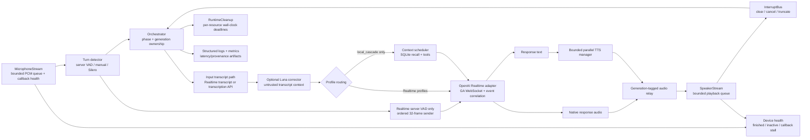

# 총체적 아키텍처·적대적 검수 보고서 (2026-07-26)

## 범위와 전제

추적 중인 Python 소스, 테스트, 실행/벤치 스크립트, 구성, README와 설계·근거
문서를 검수했다. 비밀값이 포함될 수 있는 `.env`는 내용을 읽거나 수정하지
않았다. 로그에 나타난 기존 모델 값은 `.env` 또는 프로세스 환경 override가
소스 기본값보다 우선한다는 실행 증거로만 취급했다.

이번 변경 뒤 재현 가능한 미해결 P0/P1은 없다. 이는 결함 부재의 증명이 아니라
현재 식별한 경쟁 조건과 실패 주입 케이스가 회귀 테스트로 잠겼다는 뜻이다.

## 현재 아키텍처

핵심 소유권은 `orchestrator.py`의 phase와 단조 증가 generation에 있다. Realtime
이벤트는 response ID와 generation metadata가 일치할 때만 현재 출력으로
받아들인다. 오디오와 TTS 작업도 generation을 태그해 취소 뒤 늦게 도착한 데이터가
다음 턴에서 재생되지 않게 한다.

프로파일 조립은 `providers/base.py`, 환경/TOML/default 우선순위와 세션 스키마는
`config.py`, Realtime 전송·정규화·client event 상관관계는
`providers/llm/openai_realtime.py`가 담당한다. 동적 메모리와 도구 결과는 system
권한을 받지 않는 untrusted user data로 경계가 고정돼 있다.

도식의 context scheduler는 lifecycle을 통일하려고 모든 프로파일에 조립되지만,
실제 SQLite provider와 recall 결과를 받는 것은 `local_cascade`뿐이다. 기본 Realtime
프로파일은 null memory provider를 사용하므로 시작 시 memory DB를 만들지 않고 context도
주입하지 않는다. SQLite `write_reflection`의 운영 호출자는 아직 없다. prompt,
compaction, persistence 어느 쪽에도 소비되지 않던 `TranscriptLedger`는 제거했다.
같은 이유로 실제 mic gate가 아닌 phase shadow였던 `StateMachine.mute_mic`도 제거했다.

## 로그 장애의 판정과 수정

첫 로그의 반복 응답은 매번 `[You]:`가 빈 문자열인데도 서버 VAD가 자동 응답을
만들던 경로였다. 스피커 누설이나 주변 잡음이 VAD를 깨웠을 가능성은 있지만 로그는
실제 음향 echo를 직접 증명하지 않는다. 세션의 `create_response`와
`interrupt_response`를 끄고, 비어 있지 않은 전사와 정확한 input item ID가 온 뒤에만
앱이 응답을 생성하게 했다. 기본 barge-in도 AEC 없는 노트북의 speaker→mic
재유입을 피하려고 꺼져 있다.

준비음 이전/도중의 capture callback 자체는 장치 건강 감시를 위해 계속 돌지만,
provider로 가는 mic output gate는 닫혀 있다. 준비음 drain과 post-gap이 끝나면 그동안의
mic queue를 모두 비운 뒤 gate를 연다. 따라서 현재 구현에서 삐 소리 이전·꼬리 음성은
전송되지 않는다. 이 경계는 echo 가능성을 줄이지만, 일반 대화 중 speaker→mic echo를
제거하는 AEC는 아니다.

두 번째 로그의 crash는 한 발화가 `영어 공부` / `공부하고 싶고`로 나뉜 사이,
첫 응답 ID가 늦게 도착한 경우였다. 기존 코드는 WebSocket에 cancel을 보낸 직후
서버 ACK 없이 다음 `response.create`를 보내
`conversation_already_has_active_response`를 일으켰다. 이제 response ID를 아는 scoped
cancel은 그 ID의 `response.done`으로만 종결한다. ID를 모르는 unscoped cancel은
`response.done`의 status가 completed/cancelled 어느 쪽이어도 ACK로 사용하지 않는다.
오직 original cancel `event_id`로 상관된 `response_cancel_not_active`만 한 번의
active-conflict retry를 허용한다. cancel 거부·ACK timeout 또는 retry 실패는 provider
상태를 추측하지 않고 session을 fail-closed 종료한다. 함께 발견된 전역 250 ms interrupt debounce도 제거했다. 같은 generation의
중복은 phase 전환과 lock이 막지만, 짧은 다음 턴의 정상 interrupt까지 이전 시간창이
가로막아 ghost audio와 active-response 충돌을 다시 만들 수 있었기 때문이다.

로그의 Python 프로세스는 23:04에 로드된 코드로 계속 실행되므로 그 뒤의 파일 편집이
hot-reload되어 crash를 만든 것은 아니다. 다만 작업 브랜치의 중간 revision을 시작한
실행이어서 당시에는 위 ACK barrier가 아직 없었다. 같은 로그의 `gpt-realtime-2`와
`gpt-5.4-mini` 표시는 현재 source default가 아니라 기존 `.env` 또는 process override가
우선한 별도 구성 신호다.

## 주요 결함과 조치

| 영역 | 적대적 결함 | 조치 |
| --- | --- | --- |
| 세션 시작 | `session.update`가 send-only인데 ACK 전에 mic/runtime 시작 | `session.updated` 5초 barrier, 실패 시 연결 정리 |
| 응답 경쟁 | 늦은 response ID, unscoped cancel, terminal status, 보정 교체와 active-conflict recovery의 동시 소유 | scoped는 정확한 response ID의 `response.done`, unscoped는 original `event_id`의 cancel-not-active만 ACK; generation별 single-owner CAS 뒤 상관된 경우에만 1회 retry, retry는 terminal deadline을 새로 시작하고 reject/timeout은 session fail-closed |
| 응답 생명주기 | create ACK 또는 `response.done` 유실 시 영구 `RESPONDING`/mic drop, 부분 output item의 ghost history | create 전송 직후 90초 generation watchdog; cancel ACK → profile별 truncate/delete ACK → 준비음 drain과 mic clear 뒤에만 상태 복구, ACK timeout/reject는 session 종료 |
| 프로토콜 폭주 | 고유 stale response/item마다 cancel/delete task와 ACK Future 무제한 생성 | 종류별 live 64개 상한, 초과 시 session fail-closed 종료 |
| 이벤트 큐 종료 | exact-full queue에서 EOF/error/cancel 시 sentinel 삽입이 영구 대기 | oldest payload fail-closed eviction, 단일 terminal sentinel, `task_done` accounting |
| server-VAD 전송 | WebSocket append를 mic pump가 직접 await해 network stall이 capture 소비를 정지 | 단일 ordered sender, 32-frame bounded queue, overflow/provider failure를 TaskGroup까지 payload-free fail-closed 전달 |
| 입력 장치 | PortAudio callback 종료·inactive·stall 시 `LISTENING` 상태로 영구 무음 | 50 ms poll, 2초 startup/stall 경계, finished/inactive/stall terminal 전파; 정상 종료 race는 mask |
| 입력 귀속 | 이전 턴 전사가 새 턴을 차지하거나 중복 `speech_stopped`/`speech_end`가 active response 소유권을 덮음 | speech start→stop phase 순서와 non-empty item ID 강제, committed/transcript generation·item 일치 강제; transcript timeout은 user item delete ACK 뒤에만 재사용 |
| 자율 응답 | 빈 전사와 VAD 잡음도 response 생성 | app-owned create와 non-empty gate, 빈 item 폐기 |
| 보정 교체 | speculative raw response, corrected replacement, active-conflict recovery가 동시에 provider history/response를 소유하거나 user→assistant local history 순서가 뒤집힘 | generation single-owner CAS; cancel terminal ACK → assistant truncate/delete ACK → raw user delete ACK → replacement 직렬화; raw response가 먼저 완료되면 late correction을 취소하고 raw user→assistant를 exactly-once 기록; mutation/send ambiguity는 session fail-closed |
| 보정 지연 | SDK 기본 600초 timeout과 내부 재시도로 local/realtime turn 정체 | profile 공통 5초 deadline, SDK retry 0, timeout 시 원문 fallback과 payload-free 측정 |
| 보정 입력 비용·보존 | history/raw transcript가 길어지면 메모리와 Luna prompt/API 비용이 입력에 비례해 증가 | 저장 entry 2,000자, rendered history 8,000자, current raw 4,000자, complete prompt 12,000자 상한; entry는 양끝 보존 middle clip, raw 초과는 API를 부르지 않고 원문 반환 |
| 수동 입력 | commit/clear 성공 ACK가 세대 정보 없이 늦게 와 새 입력을 차지하거나 remote clear가 새 PCM을 지움 | commit/clear success에도 operation generation을 전파하고 current generation만 적용; boundary ACK 전 mic/reset/new turn 차단, correlated current-generation error의 clear ACK 뒤에만 재사용; stale/missing/reject/timeout은 fail-closed |
| user-turn 트랜잭션 | context/user item 일부가 성공한 뒤 item-create/response-create 비동기 오류를 Listening 복구하면 ghost context나 active billing이 남음 | Realtime이 전체 transaction rollback ID를 주지 않으므로 correlated async user-turn control 오류는 session-fatal 처리 |
| 출력 무결성 | barge-in, failed/incomplete 또는 들리지 않은 전체 답변을 history에 저장 | completed+실제 playback 성공만 local history commit; remote truncate/delete ACK 전 다음 response 금지, 정상 완료의 unheard item은 ACK까지 `RESPONDING`, reject/timeout은 session fail-closed |
| 무음 completed item | output item ID는 있지만 transcript/audio delta가 0이면 text guard 때문에 remote item 삭제를 건너뜀 | `delivery_succeeded`를 text 유무와 분리하고 들리지 않은 output item은 항상 delete; 수정 전 실패하는 회귀로 고정 |
| interruption 기록 | 생성 중 partial text를 local correction history에 남기면 사용자가 못 들은 내용을 다음 turn의 사실로 오인 | partial content는 char count만 기록하고 폐기; Realtime은 실제 들은 prefix까지만 truncate, external TTS는 full assistant item delete, mutation ACK 뒤 generic interruption note만 기록 |
| stale 데이터 | 같은 item의 여러 delta가 중복 delete | bounded item-ID dedup; 모든 authoritative delete/truncate는 server ACK barrier를 거치며 reject/timeout은 unsafe session 종료 |
| 종료 | child `CancelledError`가 이후 close를 건너뜀; cancellation-resistant task/default executor가 CLI 종료를 붙잡음 | 자원별 격리, CLI-owned bounded loop, daemon cleanup/SQLite worker와 subprocess watchdog |
| 시작 시 외부 부작용 | 외부 TTS profile이 사용자 발화 전 ElevenLabs에 `.` 합성 warmup을 보내 비용, text egress와 생성 PCM 수신을 발생 | startup warmup 호출·provider method 제거; 실제 첫 응답 전에는 외부 TTS 요청 0 |
| STT/TTS 재시도 | timeout/read/write/429/5xx를 자동 replay해 중복 전사·합성·오디오·과금 가능 | connection establishment 이전임이 증명된 실패만 1회 retry; ElevenLabs pre-audio ConnectError/ConnectTimeout, Whisper direct-cause ConnectError만 허용하고 나머지는 request-level fail-closed |
| 출력 장치 | callback 정지 시 drain 영구 대기, 일부만 들은 전체 답변을 history에 commit | inactive/finished/2초 stall 감지, PCM fail-closed clear, playback 실패면 full history 폐기 |
| 자원 경계 | 무제한 큐/작업/발화/컨텍스트 | bounded audio/event/TTS queues, utterance cap, context size/count/deadline |
| 신뢰 경계 | memory/tool/transcript가 상위 지침처럼 주입될 수 있음 | untrusted-data delimiters와 명시적 trusted instruction만 system role |
| 비용 관측 | cache 총량만 있고 modality/ASR/cache-write가 누락 | Realtime text/audio/image/cached/output 분해, ASR 별도 usage, Luna cache-write telemetry |
| 구성 | ambient `MODEL`/SDK `OPENAI_BASE_URL` 충돌, import 시 credential 종료, 잘못된 profile 조합 | `ZEMORY_` nested env와 검증된 endpoint만 허용, runtime credential 검증, Pydantic 범위/능력 검증 |
| 무효 구성 | consumer 0인 `max_context_turns`/`ZEMORY_MAX_CONTEXT_TURNS`가 동작하는 옵션처럼 노출 | config/TOML/env example과 관련 테스트에서 no-op 설정 제거 |
| 메모리 경계 | SQLite 전체표 조회가 deadline 뒤에도 thread에서 계속되고 새 DB 권한이 넓을 수 있음 | SQL 후보 최대 512개, SQLite busy/progress deadline, 실제 worker drain, 새 DB 0600 |
| 프로파일 부작용 | memory를 소비하지 않는 Realtime도 설정된 SQLite DB를 생성 | profile-aware scheduler 조립; `local_cascade`만 SQLite를 열고 Realtime은 null provider 사용 |
| shadow 상태 | 소비자 없는 `TranscriptLedger`와 실제 gate가 아닌 `mute_mic`이 권위 있는 상태처럼 보임 | 둘 다 제거하고 provider history와 generation/phase ownership만 유지 |
| 오류 프라이버시 | provider 예외 객체를 다시 raise하면 payload/transcript가 traceback에 잔존 | runtime/provider/cleanup terminal 경계에서 오류 종류·코드만 새 예외로 변환하고 원인 체인 제거 |
| 구조적 종료 | 2천 줄 orchestrator의 cleanup closure가 turn logic과 같은 장애영역 | `RuntimeCleanup`으로 분리, 자원별 독립 wall-clock deadline과 payload-free error 수집 |
| 벤치 신뢰성 | 실효 session과 기록 config 불일치, 불완전 hash, nested secret 노출 가능 | 실효 config/PCM/source hash, recursive redaction, strict canonical re-hash 검증 |
| 의존성 표면 | 미사용 검색 의존성과 미구현 extras가 설치/lock/지원 표면 확대 | dead direct dependency/extras 제거, 직접 import하는 Pydantic 명시, lock 146→68 packages |

## 모델·비용·긴 세션 결정

- Realtime 기본값은 [`gpt-realtime-2.1`](https://developers.openai.com/api/docs/models/gpt-realtime-2.1), reasoning effort는 `low`, 서버 출력 하드캡은
  512 tokens다. 한 샘플 live smoke에서 새 세션 스키마가 수락되고 첫 audio가
  687.8 ms에 도착했다.
- [`gpt-realtime-2.1-mini`](https://developers.openai.com/api/docs/models/gpt-realtime-2.1-mini)는 큰 비용 이점이 있지만 현재 fixture가 의미 품질을
  채점하지 않으므로 기본값으로 승격하지 않았다. opt-in은 환경 변수 한 줄이다.
- 보정기는 [`gpt-5.6-luna`](https://developers.openai.com/api/docs/models/gpt-5.6-luna), `reasoning_effort=none`으로 이동했다. 9개 합성 fixture에서
  Luna 9/9, 5.4 mini 8/9였지만 작은 표본이며 Luna의 공개 단가는 cache-write를
  제외한 동일 토큰 혼합에서 33.3% 높다.
- [Realtime prompt caching](https://developers.openai.com/api/docs/guides/prompt-caching)은 별도 on/off 옵션이 아니라 서버의 자동 best-effort
  동작이다. 실제 첨부 로그에서도 cached token hit가 관측됐다. 매 턴 오래된 item을
  삭제하던 방식은 cache prefix를 반복 파괴하므로 제거하고 native
  `retention_ratio=0.8`/post-instructions 8000을 사용한다.
- 외부 TTS warmup은 첫 응답 latency를 줄일 수 있어도 앱 실행만으로 ElevenLabs
  합성과금, `.` text egress와 생성 PCM 수신을 만든다. 실제 사용자 응답 전 outbound
  요청 0을 더 중요한 계약으로 택해 제거했다. 그 결과 external-TTS profile의 첫 실제
  응답에는 cold-start latency가 다시 포함될 수 있다.
- Luna corrector는 stored entry/history/raw/full prompt를 각각
  2,000/8,000/4,000/12,000자로 제한한다. 4,000자를 넘는 현재 raw transcript는
  길이만 payload-free logging하고 API call 없이 원문으로 fallback한다. 문자 상한은
  token 상한과 동일하지 않지만 retained secret surface와 최악 입력 비용을 유한하게 한다.
- 최신 Codex CLI compaction의 90% scoped trigger, pre/mid-turn 구분, 최근 사용자
  메시지 보존, atomic replacement history를 소스 commit에 고정해 비교했다. Realtime
  transport에는 atomic replacement/encrypted compaction item이 없어 문자 그대로의
  100% 포트는 안전하지 않다. 약 1.3k줄의 throwaway 실험 구현은 production caller가
  없는 dead subsystem이라 제거했다. patch artifact가 남지 않아 그 줄 수는 재현 가능한
  release evidence가 아니다. 세션 rollover 기반의 원자적 교체가 향후 올바른 방향이다.

## 독립 실험과 채택 판정

독립 작업은 production merge 전 동일 실패 경계나 synthetic fixture로 검증했다.
microbenchmark는 어느 단계의 시간인지 분리해 해석했으며 producer isolation을
end-to-end latency 개선으로 바꾸어 주장하지 않는다.

| 후보 | 실제 검증 또는 구조 증거 | 판정 |
| --- | --- | --- |
| server-VAD ordered sender 32 | 20 ms-paced hung send n=3에서 first rejection median 717.199 ms, waiting frame 32; 0.5 ms append 1,000-frame n=5에서 producer boundary median 20.751 ms, full drain 667.267 ms, 1,000/1,000 전달 | 채택. mic pump와 network stall의 소유권을 분리하고 discontinuity를 조기에 terminal 처리한다. |
| sender queue 64 | 같은 hung-send n=3에서 first rejection median 1417.110 ms, waiting frame 64. 32가 약 49.4% 빨리 실패를 드러냈다. | 기각. 더 긴 queue는 처리량을 높이지 않고 이미 오래된 audio와 고장 탐지만 늦춘다. |
| direct-await sender | 0.5 ms append 1,000-frame n=5 producer boundary median 671.328 ms. queued full drain 667.267 ms와 사실상 같은 end-to-end 전송량이다. | 기각. mic pump를 transport latency에 결합하며 속도 이득도 없다. |
| 자동 memory pruning | production writer 0, expiry/pin/retention 정책 0. Synthetic 1k/10k/50k rows는 DB 0.307/2.900/14.500 MB로 선형 증가했지만 recall p50 0.622/0.659/0.623 ms였다. | 기각. 현 단계 병목이 아니며 임의 oldest/importance 삭제는 사용자 기억을 파괴한다. disk/privacy 정책과 writer를 함께 설계해야 한다. |
| usage parsing helper 추출 | 72줄, captured state 0으로 추출 가능했지만 재사용·동작·검증 이득 없이 module/monkeypatch 표면만 증가했다. | 기각. 현재 인라인 계약과 테스트를 유지한다. |
| manual/Realtime sender 공통화 | 표면 중복은 약 40줄이지만 manual path가 endpoint watermark, commit/reset barrier와 3개 task lifecycle에 결합돼 있다. | 기각. 모양만 같은 전송을 합치면 서로 다른 commit 의미와 회귀 표면을 숨긴다. |
| LLM event consumer 일괄 분리 | consumer 531줄/외부 state 51개, correction path 216줄/외부 state 27개로 독립 객체 경계가 아니다. | 기각. prototype 없는 대형 이동 대신 다음 seam을 bounded item-ID/ACK registry로 제한한다. |
| `RuntimeCleanup` 추출 | turn 소유권을 capture하지 않고 자원별 deadline·오류 수집을 단독 테스트할 수 있었다. | 채택. 구조 단순화와 실제 종료 상한을 동시에 얻었다. |
| Codex식 session rollover | Realtime에 atomic history replacement, assistant audio history 재구성, opaque compaction item API가 없고 runtime에도 canonical history source가 없다. | 현 병합 기각. dual-session ACK/fault 처리와 live fidelity benchmark를 갖춘 별도 설계가 필요하다. |
| AEC | 현재 Python runtime/장치 조합에 검증된 DSP 경계가 없고 headset·speaker별 실제 측정이 필요하다. | 보류. barge-in 기본 off를 유지한다. |
| 자동 reconnect | mic/speaker/transport buffer ownership과 history replay 정책이 없어 재전송 과금, 중복 capture/response 위험이 있다. | 기각. 현재는 payload-free terminal 실패 후 명시적 restart가 더 안전하다. |

## 그 밖에 채택하지 않은 변경

- mini를 기본값으로 설정: 품질 근거가 없어서 보류.
- 더 엄격한 Luna prompt: Luna 정확도가 9/9에서 8/9로 내려가 폐기.
- 매 턴 oldest item 삭제: 이후 모든 cache prefix를 흔들어 비용에 불리해 폐기.
- Realtime 세션 안에서 Codex history를 여러 item delete/create로 직접 교체: 중간
  실패 시 부분 history가 남아 원자성이 없어 폐기.
- AEC 없는 환경에서 barge-in 기본 활성화: self-interrupt/echo 위험 때문에 폐기.

## 남은 한계와 우선순위

1. 자동 server-VAD n=8은 8/8 유효·early cutoff 0이지만 final source audio→first
   API audio p50/p95 1574.5/2013.7 ms로 700/1200 ms 목표를 넘는다. 정확성 수정은
   채택했지만 이를 성능 개선으로 주장하지 않는다.
2. barge-in을 사용자가 다시 켜면 이 런타임에는 acoustic echo cancellation이 없다.
   headset/AEC 장치 없이 full-duplex 수준의 동작은 보장하지 않는다.
3. Codex와 동등한 atomic compaction은 아직 없다. 현재 방식은 Realtime native
   truncation이며 먼 대화 기억을 더 빨리 잃을 수 있다.
4. 수동 commit send 실패·timeout은 server 적용 여부가 불명확하므로 clear로 복구하지
   않고 session을 종료한다. 현재 generation에 상관된 비동기 commit 오류에 한해 clear를
   보내며, `input.cleared` ACK를 받은 뒤에만 buffer를 재사용한다. transport가
   불건전하면 사용자가 재시작해야 한다. 자동 reconnect는 history replay와 buffer
   ownership 정책이 없어 구현하지 않았다.
5. server-VAD ordered sender는 mic pump를 단일 in-flight append에서 분리하지만 개별
   provider append를 강제 중단할 수는 없다. 32개 waiting frame이 차면 입력 연속성을
   보존하려고 session을 끝낸다. 이 선택은 고장 노출 상한을 줄이지 network latency를
   개선하지 않는다.
6. mini/Luna 평가는 작고 고정된 fixture다. 배포 기본값을 다시 바꾸려면 블라인드
   의미 품질 평가와 동시대 비용·latency 표본이 필요하다.
7. 새 SQLite memory DB는 0600으로 생성하지만 기존 사용자 파일의 권한은 자동으로
   바꾸지 않는다. 현재처럼 `.env` 또는 기존 `.zemory/memory.sqlite3`가 0644이면
   같은 로컬 그룹 사용자가 읽을 수 있으므로 사용자가
   `chmod 600 .env .zemory/memory.sqlite3`로 제한해야 한다.
8. SQLite 저장/조회 primitive는 있지만 자동 reflection writer, pruning, runtime
   tool 등록이 없고 기본 Realtime 프로파일은 scheduler recall을 소비하지 않는다.
   `local_cascade`에 별도 writer를 연결하면 durable DB는 계속 커질 수 있으며 bounded
   importance 후보 선택은 낮은 중요도의 관련 기억을 놓칠 수 있다. 현재 Realtime
   프로파일은 DB를 초기화하지 않는다.
9. `orchestrator.py`는 상태·generation 소유권을 한곳에 모은 장점과 동시에 2천 줄이
   넘는 closure 기반 단일 장애영역이다. cleanup은 분리했지만 event consumer 일괄
   추출은 51개 외부 state 때문에 기각했다. 다음 작은 seam은 bounded item-ID/ACK registry며
   현재 race tests를 그대로 통과해야 한다.
10. 현재 production SQLite/cleanup 경로는 daemon worker를 쓰지만 Python은 임의의
   서드파티 non-daemon executor thread를 강제 종료할 수 없다. 향후 provider가 그런
   thread를 추가한다면 subprocess supervisor 없이는 절대적인 process-exit 상한을
   주장할 수 없다.
11. mic 2.5초·speaker 0.6초 actual probe는 이 개발 Mac의 기본 PortAudio 장치 한 번을
    확인한 짧은 smoke다. 여러 장치, sample-rate 변환, hot-unplug, 장시간 sleep/wake를
    포괄하는 hardware compatibility 증거는 아니다. 장치 유실은 감지하지만 자동으로
    재연결하지 않는다.

## 검증 증거

- 전체 회귀: 436 passed (9.50 s)
- 전체 패키지 coverage: 87.69% (gate 80%)
- `uv sync --frozen`, Ruff, `compileall`, `git diff --check`: 통과
- server-VAD hung-send: queue 32/64 각 n=3, first rejection median
  717.199/1417.110 ms; 32 채택, 64 기각
- server-VAD 0.5 ms append 1,000-frame n=5: direct producer boundary median
  671.328 ms, queued enqueue 20.751 ms, queued full drain 667.267 ms,
  queued delivery 1,000/1,000
- speaker active→inactive no-PCM failure injection n=20: 20/20 terminal,
  TaskGroup p50/p95/max 52.110/52.396/52.415 ms; 구 구현은 200 ms 내 미종료
- 실제 mic 2.5초 probe: callback 123회, first 166.8 ms, max gap 20.4 ms,
  health failure 0, clean stop; PCM은 즉시 폐기하고 저장·전송하지 않음
- 실제 speaker 0.6초 zero-output probe: 53 samples, inactive/health failure 0,
  terminal failure 없는 clean stop; 가청 content/API call 없음
- SQLite synthetic recall n=1k/10k/50k: DB 0.307/2.900/14.500 MB,
  recall p50 0.622/0.659/0.623 ms; 임의 pruning 기각
- startup external-TTS warmup 회귀: 사용자 turn 전 provider warmup call 0
- corrector adversarial fixture: history input 10,000,080자 → in-memory
  20,000자(10 entries) → API history 7,173자, complete prompt 12,000자;
  4,000자 초과 current raw는 API skip·원문 보존 확인
- provider ownership failure injection: unrelated completed/cancelled
  `response.done`은 unscoped cancel barrier를 해제하지 않으며,
  cancel/mutation/input-clear reject·ACK timeout은 모두 unsafe session 종료
- STT/TTS retry matrix: pre-connect 증명이 있는 단 한 종류의 adapter-owned
  retry만 허용하고 read/write/non-connect timeout/429/5xx는 두 번째 요청 0
- Realtime 2.1 새 `max_output_tokens=512` 세션 live smoke: 1/1 성공
- Realtime migration: full/mini forced-commit 각각 n=8, full automatic-VAD n=8,
  모두 invalid/early cutoff 0/0
- Luna correction A/B: 모델별 n=9, aggregate-only provenance

## 사용자 요구 추적성

| 요구 | 구현·결정 | 검증·근거 |
| --- | --- | --- |
| 프로젝트 문서·소스 전체 파악과 총체적 적대 검수 | 현재 아키텍처, 결함 표, 잔여 한계와 독립 후보 판정을 이 문서에 통합 | 436-test 전체 회귀(9.50 s), 87.69% coverage, failure injection과 numeric-only benchmark |
| 한 번 말한 뒤 반복 자율응답 원인·수정 | server auto-create를 끄고 정확한 item의 non-empty transcript 뒤 app-owned create; 준비음 중 mic gate/queue clear; barge-in 기본 off | 빈 transcript/noise/echo 경계 regression, 실제 음향 echo 여부는 로그만으로 단정하지 않음 |
| `conversation_already_has_active_response` crash | scoped는 exact response-ID terminal, unscoped는 original cancel `event_id`의 not-active만 ACK; 상관된 ACK 뒤 1회 retry, reject/timeout은 session fail-closed | late ID, unrelated completed/cancelled terminal, cancel/create ordering, stale generation, timeout/error regression |
| 실행 방법과 기존 `.env` | `uv sync --frozen` 뒤 `uv run python -m zemory`; root `.env` 자동 load, process env가 우선 | [README Quick Start](../../README.md#quick-start)와 [Configuration](../../README.md#configuration); 기존 override가 source model migration을 가릴 수 있음을 명시 |
| prompt caching과 비용 | Realtime automatic best-effort cache 유지, modality/ASR/cache-write usage 분리, retention ratio 0.8 | cached token 관측과 [공식 prompt caching 문서](https://developers.openai.com/api/docs/guides/prompt-caching), [Realtime cost guide](https://developers.openai.com/api/docs/guides/realtime-costs) |
| 최신 Codex CLI compaction 100% 추종 독립 검토 | 최신 source의 trigger/history semantics를 고정 비교; Realtime atomic replacement 부재로 literal port 기각, native truncation 유지 | [Codex compaction compatibility](codex-compaction-compatibility-2026-07-26.md); session rollover도 별도 fidelity/ACK 증거 전에는 미병합 |
| `gpt-5.4-mini`→`gpt-5.6-luna` reasoning 없음 | corrector 기본을 Luna/`none`으로 이동 | [Luna migration](transcript-corrector-luna-migration-2026-07-26.md): fixture 9/9 vs 8/9, 비용 33.3% 높음 명시 |
| `gpt-realtime-2`→2.1과 2.1-mini 검토 | full 2.1 기본, mini opt-in 유지 | [Realtime 2.1 migration](realtime-2.1-migration-2026-07-26.md): forced n=8/model, full auto-VAD n=8, invalid/early 0/0; 의미 품질 부재로 mini 기본 기각 |
| 실제 개선만 병합하고 미개선도 기록 | sender32, device health, profile-aware memory, cleanup/sanitization은 채택; sender64, pruning, helper/commonization, 대형 consumer split, rollover, 자동 reconnect는 기각/보류 | 위 `독립 실험과 채택 판정` 표의 단계별 수치·구조 근거; producer isolation과 end-to-end latency를 구분 |

관련 상세 문서:

- [Realtime 2.1 migration](realtime-2.1-migration-2026-07-26.md)
- [Luna correction migration](transcript-corrector-luna-migration-2026-07-26.md)
- [Codex compaction compatibility](codex-compaction-compatibility-2026-07-26.md)
- [Realtime migration benchmark artifact](../benchmarks/2026-07-26-realtime-model-migration/)
